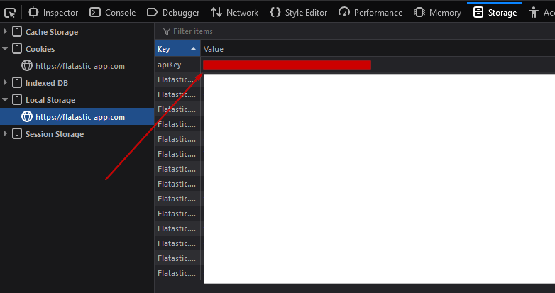

# Flatastic Finance Export

Creates a nice XLSX export for your Flattastic expenses. Straight from the flatastic api

## Requirements

- [Node.js](https://nodejs.org/) >= `7.6.0` (I think, just install the latest release, or LTS and you're ok)
- [yarn](https://yarnpkg.com/lang/en/) (optional, should work with npm)

## Installation

- Clone this repository, open the project in a terminal
- `yarn` to install dependencies (or `npm i` respectively)
- Create a `config.json` file (see `config.example.json`) and add your api key (see below on how to get it)

## Usage

- Import the data from the Flattastic API: `yarn run import` (`npm run import` respectively)
- Create an XSLX Export `yarn run export` (`npm run export` respectively). This generates an Export file in the project directory

## Getting Your API Key

1. Open the [Flattastic Webapp](https://flatastic-app.com/webapp/) on your desktop browser
2. Login with your account
3. After a successful login open the developer tools (F12 on Firefox) and select the Storage tab (might be in the overflow menu)
4. Under 'Local Storage' you'll find your API key in the field `apiKey` (see image below)

